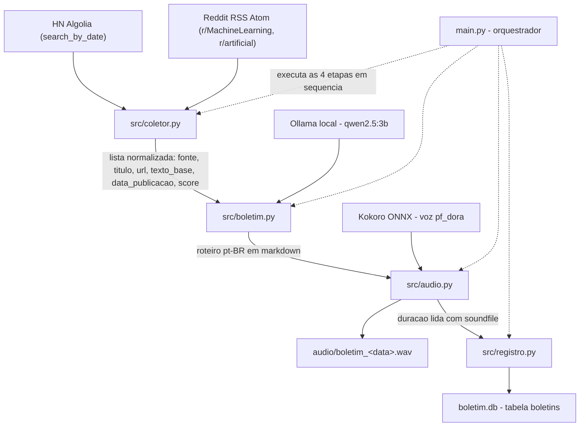

# Boletim IA

Pipeline de automação que **coleta notícias de Inteligência Artificial, escreve um roteiro
em pt-BR com um LLM local e entrega o resultado em áudio**, registrando cada execução num
banco SQLite.

Entrega da disciplina **AI Factory — Etapa 1** (IDs 1.1, 2, 2.1 e 2.2).

## 1. Visão geral

O projeto monta um **boletim diário de notícias de IA** de ponta a ponta, sem intervenção
manual e sem chaves de API.

- **O que faz:** busca notícias recentes de IA em fontes públicas, usa um LLM local para
  transformá-las num roteiro narrado em português e sintetiza esse roteiro em voz.
- **Para quem:** quem acompanha o mercado de IA e quer o resumo em formato de áudio —
  para ouvir dirigindo, caminhando ou treinando — em vez de ler dezenas de feeds.
- **O que entrega:** um arquivo WAV com a narração do boletim do dia
  (`audio/boletim_<AAAA-MM-DD>.wav`) e um registro da execução (data, quantidade de
  notícias, roteiro completo, caminho do áudio e duração) na tabela `boletins` do
  `boletim.db`.

## 2. Contexto, problema e solução

**Problema.** Acompanhar notícias de IA manualmente todos os dias gera **fadiga de
informação** (dezenas de títulos repetidos sobre os mesmos anúncios) e **atraso**: quem lê
feed por feed gasta tempo que não tem, e o que sobra é uma pilha de abas abertas, não um
resumo aproveitável.

**Solução.** Automatizar o ciclo em 4 etapas:

1. **Coleta** — busca notícias recentes em fontes públicas sem chave de API.
2. **Curadoria por LLM local** — um modelo rodando na própria máquina agrupa as notícias por
   tema e escreve um roteiro fluido em pt-BR (nada é enviado para serviços externos).
3. **Síntese de voz** — o roteiro vira áudio narrado em português, offline.
4. **Registro em banco** — os metadados da execução são gravados em SQLite, criando o
   histórico dos boletins gerados.

## 3. Diagrama do pipeline



Em texto:

```
HN Algolia + Reddit RSS (Atom)
        |
        v
   src/coletor.py                 (Input: coleta e normaliza)
        |
        v
   src/boletim.py  <--  Ollama qwen2.5:3b   (Process: roteiro pt-BR)
        |
        v
   src/audio.py    <--  Kokoro ONNX (voz pf_dora)   (Output: narracao)
        |
        +--> audio/boletim_<data>.wav
        +--> boletim.db (tabela boletins)

   tudo orquestrado por main.py
```

## 4. Estrutura do repositório

```
faculdade-automacao-relatorio/
├── main.py                     # Orquestrador: encadeia as 4 etapas do pipeline
├── CONTEXTO.md                 # Diário técnico do projeto (estado, log de tarefas, fila)
├── README.md                   # Este arquivo
├── requirements.txt            # Dependências com versões fixadas (pip install -r)
├── .gitignore                  # Exclui modelos, banco, áudios de boletim e output/
├── docs/                       # Documentos de entrega: diagnóstico (ID 1.1) e Canvas (ID 2)
├── src/
│   ├── coletor.py              # Input: HN Algolia + Reddit (feed RSS Atom)
│   ├── boletim.py              # Process: roteiro pt-BR via Ollama /api/chat
│   ├── audio.py                # Output: TTS Kokoro ONNX -> WAV PCM_16 24 kHz
│   └── registro.py             # Persistência: tabela `boletins` em SQLite (stdlib)
├── scripts/
│   ├── download_kokoro.py      # Baixa os modelos do Kokoro para models/ (retomável)
│   ├── smoke_kokoro.py         # Smoke test do TTS: gera audio/smoke.wav
│   └── md_para_pdf.py          # Converte os documentos de docs/ em HTML (para gerar PDF)
├── audio/                      # Saída de áudio (boletim_<data>.wav; smoke.wav versionado)
├── output/                     # Saídas de texto dos testes (ex.: boletim_texto.md)
└── models/                     # Modelos Kokoro (fora do git; reconstruir pelo script)
```

`models/`, `boletim.db`, `audio/boletim_*.wav` e `output/` **não são versionados**: são
artefatos gerados em tempo de execução e reconstruíveis. O `audio/smoke.wav` permanece no
repositório de propósito, como evidência pequena do funcionamento do TTS.

Em `docs/` ficam os documentos de entrega, em Markdown (fonte) e PDF:
`01_diagnostico_id1_1.md` (diagnóstico da necessidade — Critério 1 / ID 1.1) e
`02_canvas_id2.md` (Canvas de planejamento — Critério 2 / ID 2). Depois de editar o Markdown,
os PDFs são regerados assim:

```powershell
python scripts/md_para_pdf.py docs/01_diagnostico_id1_1.md docs/02_canvas_id2.md
# abra o .html gerado no navegador e use Ctrl+P -> Salvar como PDF
```

## 5. Stack e pré-requisitos

| Item | Versão / observação |
|------|---------------------|
| Python | 3.11 (validado em 3.11.9) |
| `requests` | 2.34.2 — coleta HTTP |
| `kokoro-onnx` | 0.6.1 — TTS local |
| `numpy` | 2.4.6 — manipulação dos arrays de áudio |
| `onnxruntime` | 1.30.0 — execução do modelo ONNX |
| `phonemizer` | 3.4.0 — fonemização |
| `espeakng-loader` | 0.2.4 — traz o espeak-ng embutido (necessário para pt-BR) |
| `soundfile` | 0.14.0 — leitura/escrita de WAV |
| `edge-tts` | 7.2.8 — instalado, **não usado** no pipeline (ver seção 7) |
| `Markdown` | 3.10.3 — **opcional**, usado só por `scripts/md_para_pdf.py` para gerar os PDFs de `docs/` |
| Ollama | ativo em `http://localhost:11434`, modelo `qwen2.5:3b` baixado |
| ffmpeg | 9.0.1 (build full) disponível no `PATH` |
| Modelos Kokoro | `models/kokoro-v1.0.onnx` (325,5 MB = 325.505.369 B) e `models/voices-v1.0.bin` (28,2 MB = 28.214.398 B), obtidos por `scripts/download_kokoro.py` |

## 6. Setup e execução

### 6.1 Clonar e entrar no projeto

```powershell
git clone <url-do-repositorio> faculdade-automacao-relatorio
cd faculdade-automacao-relatorio
```

Recomendado criar um ambiente virtual:

```powershell
python -m venv .venv
.\.venv\Scripts\Activate.ps1
```

### 6.2 Instalar as dependências

```powershell
python -m pip install -r requirements.txt
```

Equivalente manual, sem versões fixadas:

```powershell
python -m pip install requests kokoro-onnx numpy onnxruntime phonemizer espeakng-loader soundfile edge-tts
```

O LLM roda no Ollama (instale em <https://ollama.com>) com o modelo do pipeline:

```powershell
ollama pull qwen2.5:3b
```

### 6.3 Baixar os modelos do Kokoro

```powershell
python scripts/download_kokoro.py
```

O script é retomável (pula o que já existe e retoma downloads parciais via `Range`), grava
em `models/` e tenta primeiro o HuggingFace, caindo para as releases oficiais do GitHub se
necessário. Smoke test opcional do TTS (gera `audio/smoke.wav`):

```powershell
python scripts/smoke_kokoro.py
```

### 6.4 Rodar o pipeline completo

```powershell
python main.py
```

O orquestrador executa as **4 etapas** em sequência e imprime o progresso:

1. **Coleta** — `coletar_noticias(dias=1, max_por_fonte=10)` busca até 10 itens por fonte
   (HN + Reddit).
2. **Roteiro** — `gerar_boletim(noticias)` chama o Ollama (`/api/chat`, `qwen2.5:3b`,
   `stream=False`, `temperature=0.6`) e devolve o roteiro em pt-BR.
3. **Áudio** — `sintetizar_audio(roteiro, "audio/boletim_<AAAA-MM-DD>.wav")` narra o roteiro
   com a voz `pf_dora`.
4. **Registro** — a duração é medida com `soundfile` e o `registrar_boletim(...)` grava tudo
   em `boletim.db`.

**Saídas geradas:** `audio/boletim_<AAAA-MM-DD>.wav` e um novo registro na tabela
`boletins` de `boletim.db`. Cada etapa tem `try/except` com mensagem clara; se não houver
notícias, o programa avisa e encerra sem gerar boletim.

### 6.5 Consultar o histórico no SQLite

```powershell
python -c "import sqlite3;print(*sqlite3.connect('boletim.db').execute('SELECT * FROM boletins').fetchall(), sep='\n')"
```

Colunas da tabela `boletins`: `id`, `data_geracao`, `qtd_noticias`, `texto_boletim`,
`caminho_audio`, `duracao_audio_segundos`.

### 6.6 Rodar os módulos isoladamente

Cada módulo tem um bloco de teste no `__main__`, sempre a partir da raiz do projeto:

```powershell
python src/coletor.py    # coleta (dias=3, max_por_fonte=5) e mostra as notícias
python src/boletim.py    # coleta (dias=2, max_por_fonte=3), gera o roteiro e salva em output/boletim_texto.md
python src/audio.py      # coleta, gera roteiro e sintetiza audio/boletim_completo.wav
```

## 7. Decisões técnicas justificadas

- **Fontes públicas sem chave de API.** HN Algolia (`hn.algolia.com/api/v1/search_by_date`)
  responde 200 sem credencial. No Reddit, a rota JSON (`r/<sub>/new.json`) foi testada e
  **responde 403 nesta rede** (bloqueio por IP, com qualquer User-Agent); por isso o coletor usa
  a rota **RSS Atom** (`r/<sub>/new/.rss`) como **única rota** — o caminho JSON foi removido do
  código, para não gastar requisições nem poluir o log. O acesso anônimo ao Reddit tem rate limit
  de ~1 requisição/min, e o coletor **espera 60 s** e tenta uma única vez de novo ao receber
  **HTTP 429**. Decisão alinhada à regra do projeto de não usar serviços com credencial.
- **SQLite como banco.** O volume é de um registro por execução; um arquivo único com a
  stdlib (`sqlite3`) dispensa servidor, instalação e dependência externa, e já dá consultas
  SQL para auditoria do histórico.
- **Ausência de scraping das URLs originais.** O LLM recebe apenas o que o coletor entrega
  (fonte, título, URL e `texto_base`). Evita quebrar com HTML/anti-bot e mantém a coleta
  previsível; a limitação correspondente está documentada na seção 9.
- **Kokoro ONNX local em vez de `edge-tts`.** O `edge-tts` depende do serviço do Edge
  (online). O Kokoro roda **offline**, sem serviço externo, sem credencial e sem custo por
  caractere — requisito de privacidade e previsibilidade para o projeto.
- **Voz `pf_dora` com chunks.** O Kokoro degrada com textos longos (os roteiros passam de
  2000 caracteres), então o roteiro é dividido em **chunks de até 400 caracteres**,
  respeitando limites de frase/palavra, e **0,12 s de silêncio** são inseridos entre eles
  para a fala não "colar". A saída é **WAV PCM_16 a 24 kHz**.
- **Regra anti-alucinação no `system prompt`.** O `PROMPT_SISTEMA` de `src/boletim.py`
  proíbe explicitamente inventar fatos, empresas, detalhes técnicos ou significados de
  siglas; com `texto_base` curto ou vazio, o modelo deve se limitar a apresentar o título,
  sem especular.
- **Roteiro sem repetição.** A primeira versão do prompt mandava "agrupar as notícias por
  temas", e o modelo de 3B passou a **reciclar itens** para preencher os blocos temáticos
  (na gravação `id=2` do banco, "Compute:Arena" aparece 3 vezes, "Axiom" 2 vezes e o tema
  "usar Claude para criar jogos" 2 vezes — a coleta daquela execução **não** tinha
  duplicatas, o problema era do LLM). O roteiro passou a ser **linear** (introdução curta,
  notícias uma a uma na ordem recebida, conclusão curta), com **menção única** por notícia
  (cada item da lista aparece exatamente uma vez, e assunto repetido entre entradas é citado
  só uma vez), **proibição de citar fonte/prefixo/URL** (nada de `HN:`, `Show HN:`, `Reddit:`
  ou links) e **proibição de citar data, dia, mês, ano ou horário** (no máximo "hoje"; o
  roteiro antigo inventava "20 de setembro de 2026"). No Ollama, `temperature=0.6` foi
  mantida e somaram-se `repeat_penalty=1.2` e `repeat_last_n=1024`, que penalizam trechos
  repetidos ao longo de **todo** o roteiro (o default do `repeat_last_n` cobre apenas as
  últimas 64 tokens). Complemento de defesa em profundidade: o `src/coletor.py` agora
  **deduplica a entrada** por URL normalizada e por similaridade de título
  (`difflib.SequenceMatcher` >= 0.85, apenas stdlib).

## 8. Evidências de funcionamento

Execução ponta a ponta em **2026-09-17**:

| Métrica | Valor |
|---------|-------|
| Notícias coletadas | 20 (HN + Reddit) |
| Roteiro gerado | 3185 caracteres |
| Arquivo de áudio | `audio/boletim_2026-09-17.wav` |
| Tamanho do áudio | 9.663.850 B |
| Amostras | 4.831.903 |
| Taxa de amostragem | 24000 Hz |
| Formato | PCM_16 |
| Duração | 201,33 s |
| Chunks de TTS | 11 |
| Registro no banco | `id=1` em `boletim.db` (o banco acumula 2 execuções; arquivo de 16.384 B) |

Smoke test do TTS: `audio/smoke.wav` (177.260 B, 24000 Hz, 3,69 s, voz `pf_dora`).

**Sobre o arquivo de áudio.** O nome do WAV usa a data do dia, então rodar o pipeline de novo no mesmo dia sobrescreve o arquivo anterior — o histórico do banco não é sobrescrito, cada execução gera uma linha nova. O áudio da execução documentada acima foi preservado como `audio/boletim_2026-09-17_primeira_execucao.wav` (9.663.850 B, 201,33 s); `audio/boletim_2026-09-17.wav` passou a conter a execução seguinte (registro id=2, 2.905.696 B, 121,07 s), o que comprova a reprodutibilidade do pipeline: duas execuções completas, dois registros independentes. Vale notar que o campo `caminho_audio` do banco registra o nome do arquivo no momento da geração — por isso a linha `id=1` aponta para `audio/boletim_2026-09-17.wav` mesmo que o áudio correspondente esteja preservado hoje como `audio/boletim_2026-09-17_primeira_execucao.wav`.

Consulta real ao banco (as duas execuções registradas):

```powershell
python -c "import sqlite3;print(*sqlite3.connect('boletim.db').execute('SELECT id, data_geracao, qtd_noticias, caminho_audio, duracao_audio_segundos FROM boletins').fetchall(), sep='\n')"
```

Saída obtida:

```
(1, '2026-09-17 02:34:21', 20, 'audio/boletim_2026-09-17.wav', 201.32929166666668)
(2, '2026-09-17 04:15:57', 20, 'audio/boletim_2026-09-17.wav', 121.07066666666667)
```

## 9. Limitações conhecidas

- **Risco residual de imprecisão no HN.** O modelo de 3B ainda pode extrapolar detalhes em
  títulos curtos do HN que chegam **sem `texto_base`** (ex.: descrever um modelo como "aberto"
  ou atribuí-lo a uma empresa que não está no título). O risco se concentra nos itens do HN,
  foi medido e é **aceito e documentado** — a mitigação atual é a regra anti-alucinação do
  prompt, não uma garantia.
- **Reddit anônimo limitado.** ~1 requisição/min por IP nesta rede (HTTP 429 se exceder) e a
  rota Atom **não expõe score** — nesses itens o campo `score` fica 0, então o ranking dos
  posts do Reddit é neutro.
- **Sem scraping.** O LLM só vê título, URL e um texto curto (`texto_base` truncado em ~500
  caracteres). A profundidade do roteiro fica limitada ao que a fonte publica.
- **Nome do áudio por data.** Rodar o pipeline mais de uma vez no mesmo dia sobrescreve o WAV
  anterior (o histórico no banco preserva todas as execuções, um registro por linha). Para
  guardar uma edição, renomeie o arquivo antes da próxima execução.
- **Repetição residual em roteiros longos.** A regra explícita e o `repeat_penalty`
  reduzem muito o problema, mas um modelo de 3B pode voltar a repetir itens quando recebe
  muitas notícias numa única execução; a mitigação estrutural é reduzir a quantidade de
  itens.

## 10. Roadmap

- **Orquestração em n8n** — agendar a execução diária, tratar retentativas e notificar
  quando o boletim do dia estiver pronto.
- **Enriquecimento por scraping das URLs originais** — extrair o texto das matérias para
  reduzir a dependência de títulos curtos e melhorar a precisão do roteiro.
- **Upgrade para modelo 7B+** — mais aderência ao material de origem e menor risco residual
  de extrapolação.
